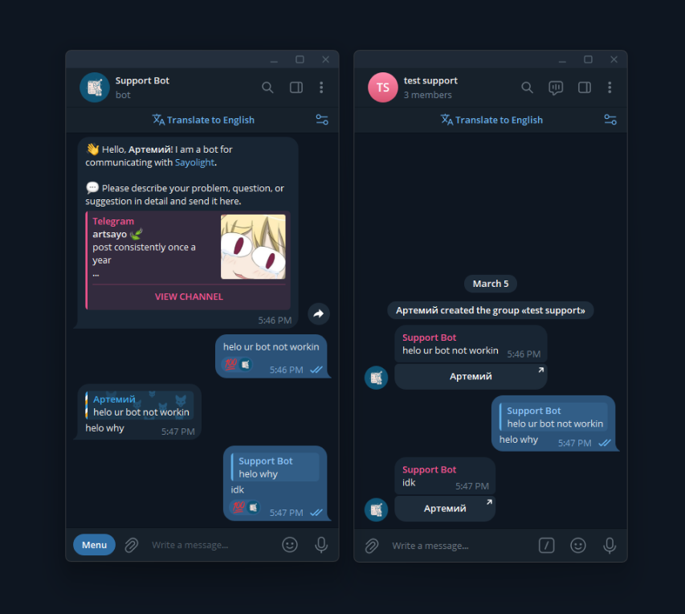

# 💭 SupportBot

[](https://telegram.org/) 
[](https://nodejs.org/)
[](https://www.typescriptlang.org/)
[](https://www.mysql.com/)

**A simple Telegram bot designed to assist with support-related tasks.**



## 🚀 Running
1. Copy `example.env` to `.env` and fill it with your data.
2. Install dependencies:
```bash
npm install
```
3. Start:
```bash
npm run bot
```

## ⚒ Configuring
- `BOT_TOKEN` Telegram bot token
- `SUPPORT_CHAT_ID` Chat ID for directing support messages
- `LOGGING_LEVEL` Options: debug / info 
- `MYSQL_HOST` Your db hostname or ip
- `MYSQL_DATABASE` Your db name         
- `MYSQL_USERNAME` Your db username 
- `MYSQL_PASSWORD` Your db user password
- `MYSQL_ROOT_PASSWORD` Your db root password

## 📄 Commands
- `start` - start command ¯\\\_(ツ)\_\/¯
- `ban` - add user to blacklist
- `pardon` - remove user from blacklist

###### Example bot: <a href="https://t.me/SayoSupportBot">@SayoSupportBot</a>
